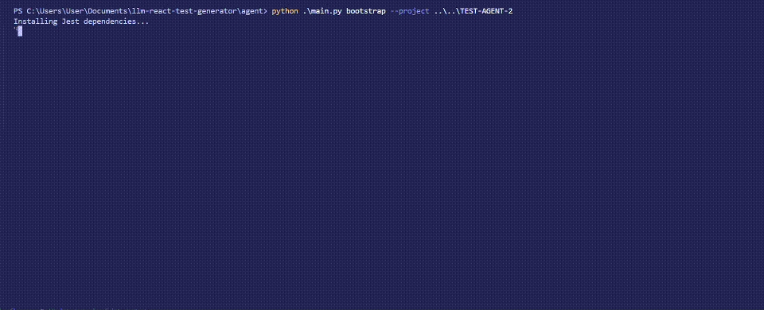
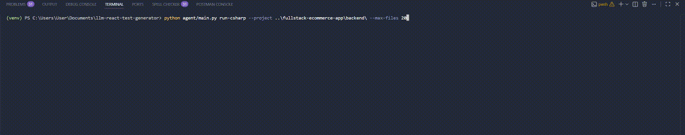
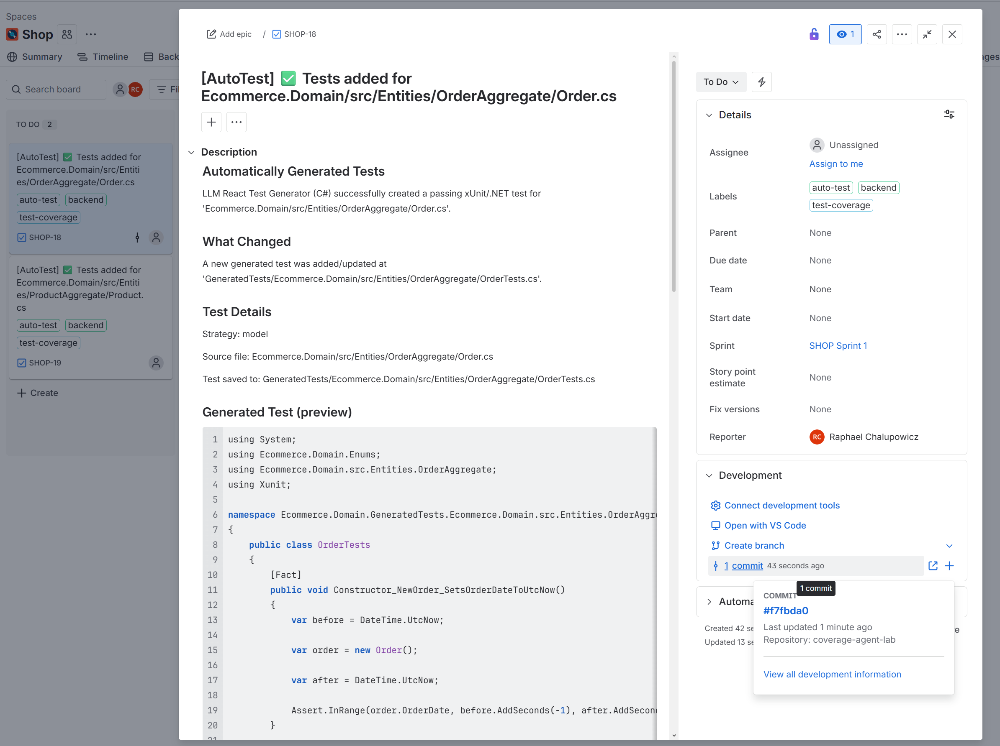
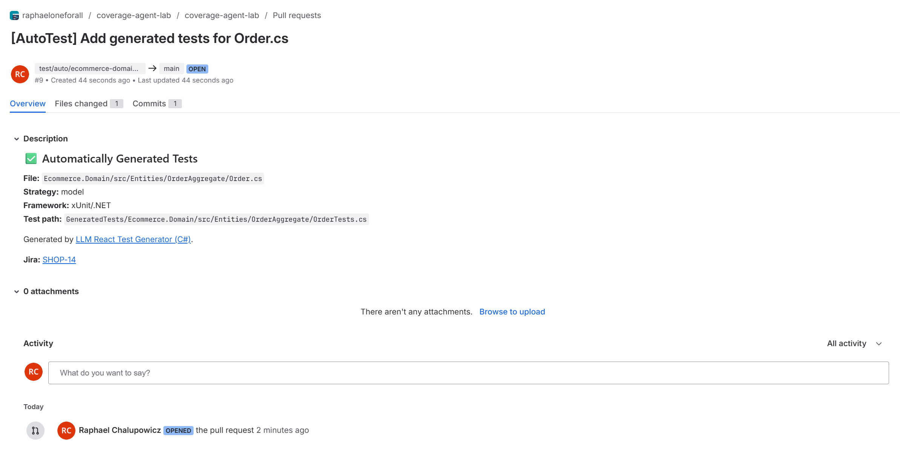
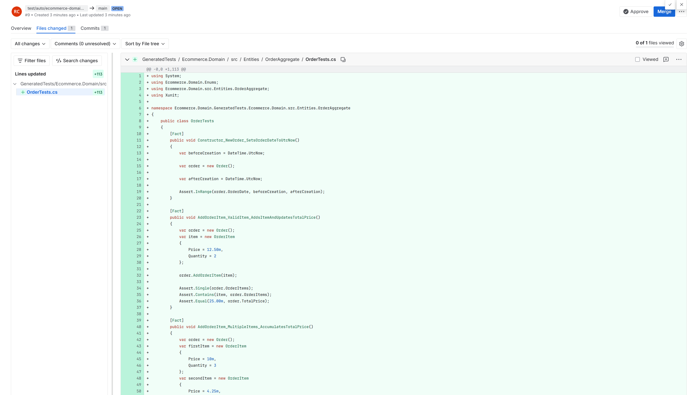
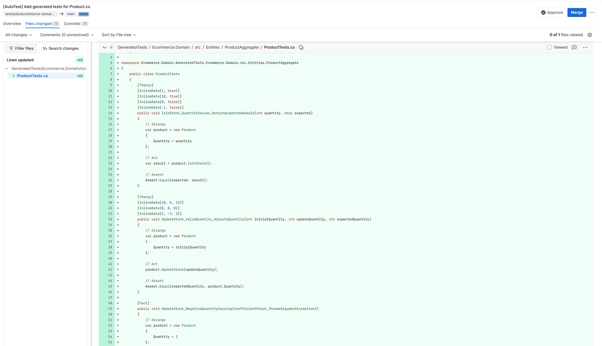

# LLM React Test Generator

An autonomous agent that generates **working tests** for React + TypeScript frontend using Jest and C# backends (xUnit + Moq) using LLM driven repair loops and built in Jira + Bitbucket integration.

---

## What it does

Given a React project, the agent:

1. Detects project setup (Jest / Vitest / Router / Redux)
2. Tries to read coverage data (coverage-summary.json)
3. If coverage is missing → falls back to scanning source files from **src**
4. Uses an LLM to decide if each file is worth testing
5. Generates a Jest / React Testing Library test using an LLM model
6. Runs tests locally
7. If the test fails → analyzes the error and fixes it (deterministic AND LLM repair loop)
8. Retries until the test passes or max attempts are reached
9. **Saves progress** so re runs skip already passing files
10. **On success** → opens a Jira issue + Bitbucket PR and links them
11. **On failure** → asks the LLM to explain the root cause, opens a "needs-work" Jira issue + draft PR with the developer guide

The result: real, passing tests committed to your repo as PRs, with Jira issues tracking coverage gaps.

For C# backends (`run-csharp`), the same lifecycle applies: generate -> run (`dotnet test`) -> repair -> retry -> report to Jira/Bitbucket.

---

## Why this is different

Most AI tools generate tests once and stop.

This Agent builds a **full lifecycle**:

```
generate → run → fail → classify → fix → retry → pass
                                              ↓
                                    Jira issue + Bitbucket PR + link
```

When auto-generation fails:

```
exhausted retries → LLM explains root cause & developer steps
                  → Jira issue (needs-work) + draft Bitbucket PR
```

---

## Architecture

```
agent/
├── main.py                         # Orchestrates the full run and bootstrap commands
├── project_analyzer.py             # Detects test runner and project capabilities
├── coverage_reader.py              # Reads coverage gap + source scan fallback logic
├── strategy_selector.py            # Chooses testing strategy by file path and type
├── test_generator.py               # LLM generation and LLM repair loop
├── test_executor.py                # Runs generated tests
├── failure_classifier.py           # Classifies errors and provides deterministic hints/fixes
├── bootstrap_jest.py               # Bootstraps Jest in projects without test setup
├── csharp_bootstrap.py             # Bootstraps GeneratedTests xUnit project
├── csharp_parser.py                # Discovers & parses C# files and strategies
├── csharp_test_generator.py        # C# xUnit generation, repair, and failure analysis
├── csharp_test_executor.py         # Runs dotnet build & test for generated C# tests
├── progress_tracker.py             # Tracks per file progress across runs
├── jira_client.py                  # Jira REST API client
├── bitbucket_client.py             # Bitbucket REST API client
└── integration_reporter.py         # Orchestrates Jira + Bitbucket reporting

(target project (--project /path/to/react-app) )
├── src/                            # (front end cmps)
├── package.json
├── coverage/coverage-summary.json  # Optional
└── tests/generated/                # generated tests
    └── .progress.json              # progress cache (auto created)

(target C# project (--project /path/to/csharp-backend) )
├── YourBackend.csproj              # main backend project file
├── Controllers/                    # or Services/, Repositories/, etc.
├── ...
└── GeneratedTests/                 # auto created by run-csharp
   ├── GeneratedTests.csproj
   ├── BootstrapTest.cs
   ├── Controllers/                # mirrors source subfolders
   │   └── UserControllerTests.cs
   └── .progress.json              # progress cache (auto created)
```

---

## Requirements

- Python 3.10+
- Node.js (with npm)
- .NET SDK (for `run-csharp`)
- A React project (TypeScript preferred)
- Coverage report (`coverage-summary.json`) - **optional**

---

## Setup

```bash
1. clone project

git clone https://github.com/RaphaelChalupowicz/llm-full-stack-test-agent.git
cd llm-full-stack-test-agent

2. Create and activate a Python virtual environment

python -m venv venv

Windows:
venv\Scripts\activate
macOS/Linux:
source venv/bin/activate

3. Install dependencies

pip install -r requirements.txt

4. Copy environment template

cp .env.example .env

4. Edit .env and set OPENAI_API_KEY and optionally Jira/Bitbucket credentials
```

You can tune runtime behavior without code changes:

```env
OPENAI_API_KEY=sk-...
OPENAI_MODEL=gpt-5.4-mini
DEFAULT_COVERAGE_PATH=coverage/coverage-summary.json
DEFAULT_MAX_FILES=2
MAX_FIX_ATTEMPTS=3
TEST_TIMEOUT_SECONDS=120
COVERAGE_THRESHOLD=80
COVERAGE_SKIP_PATTERNS=types/,assets/,.d.ts,main.tsx,vite-env,index.css,rootReducer.ts,store.ts
```

---

## Usage

1. Bootstrap a project (if needed)

```bash
python agent/main.py bootstrap --project /path/to/react-app
```

This will:

- install Jest + dependencies
- patch config (original `package.json` is backed up as `package.json.bak`)
- create test setup files

2. Run the agent

```bash
python agent/main.py run --project /path/to/react-app
```

3. Run C# backend generation

```bash
python agent/main.py run-csharp --project /path/to/csharp-backend
```

`run-csharp` arguments:

| Flag               | Default      | Description                                                          |
| ------------------ | ------------ | -------------------------------------------------------------------- |
| `--project`        | _(required)_ | Path to the target C# backend project                                |
| `--max-files`      | `2`          | Maximum number of C# source files to process per run                 |
| `--verbose`        | off          | Print full LLM prompts and responses                                 |
| `--reset-progress` | off          | Clear saved progress and re process all files                        |
| `--dry-run`        | off          | Log what C# Jira/Bitbucket operations would happen without API calls |
| `--no-integration` | off          | Disable Jira and Bitbucket even if credentials are configured        |

CLI arguments:

| Flag               | Default                          | Description                                                                |
| ------------------ | -------------------------------- | -------------------------------------------------------------------------- |
| `--project`        | _(required)_                     | Path to the target frontend project                                        |
| `--coverage`       | `coverage/coverage-summary.json` | Coverage file path relative to project root                                |
| `--max-files`      | `2`                              | Maximum number of low coverage files to process per run                    |
| `--verbose`        | off                              | Print full LLM prompts and responses (useful for debugging)                |
| `--reset-progress` | off                              | Clear saved progress and re process all files from scratch                 |
| `--dry-run`        | off                              | Log what Jira/Bitbucket operations _would_ happen without calling any APIs |
| `--no-integration` | off                              | Disable Jira and Bitbucket even if credentials are configured              |

### Progress tracking

By default, the agent saves results to `tests/generated/.progress.json`. On subsequent runs, files marked as `pass` or `skip` are skipped automatically - no wasted LLM calls after a crash or incremental run.

```bash
# Force full re run
python agent/main.py run --project /path/to/react-app --reset-progress
```

### Debugging with `--verbose`

```bash
python agent/main.py run --project /path/to/react-app --verbose --max-files 1
```

---

## Jira + Bitbucket Integration

### Setup

Add these variables to your `.env` (all are optional - any missing group disables that integration):

```env
# Jira
JIRA_URL=https://your-workspace.atlassian.net
JIRA_EMAIL=your-email@example.com
JIRA_TOKEN=your_jira_api_token
JIRA_PROJECT_KEY=SHOP
JIRA_EPIC_KEY=           # Optional: auto link to an existing epic

# Bitbucket
BITBUCKET_WORKSPACE=your-workspace
BITBUCKET_REPO_SLUG=your-react-app-repo
BITBUCKET_USERNAME=your-email@example.com
BITBUCKET_TOKEN=your_bitbucket_app_password
BITBUCKET_DEFAULT_BRANCH=main
BITBUCKET_REVIEWERS=     # Optional: comma separated Bitbucket account UUIDs
```

If frontend and backend live in different Jira/Bitbucket projects, add C# specific integration vars. `run-csharp` will prefer these and fall back to shared vars when they are empty:

```env
# C# Jira (optional, run-csharp only)
CSHARP_JIRA_URL=https://your-backend-workspace.atlassian.net
CSHARP_JIRA_EMAIL=your-email@example.com
CSHARP_JIRA_TOKEN=your_backend_jira_api_token
CSHARP_JIRA_PROJECT_KEY=BACK
CSHARP_JIRA_EPIC_KEY=

# C# Bitbucket (optional, run-csharp only)
CSHARP_BITBUCKET_WORKSPACE=your-backend-workspace
CSHARP_BITBUCKET_REPO_SLUG=your-backend-repo
CSHARP_BITBUCKET_USERNAME=your-email@example.com
CSHARP_BITBUCKET_TOKEN=your_backend_bitbucket_app_password
CSHARP_BITBUCKET_DEFAULT_BRANCH=main
CSHARP_BITBUCKET_REVIEWERS=
```

### What happens on a successful test

1. The passing test is committed to a new branch `test/auto/{file-slug}` in the Bitbucket repo
2. A Jira issue is created: `[AutoTest] ✅ Tests added for src/components/Button.tsx`
   - Labels: `auto-test`, `test-coverage`, `frontend` (or `backend` for `run-csharp`)
   - Description includes **what changed** (file/path/strategy), test preview, and framework details
3. A Bitbucket PR is opened from `test/auto/...` → `main` with the Jira key in the description
4. The Bitbucket PR URL is attached as a remote link on the Jira issue

### What happens when test generation fails

1. The last test attempt is committed to a new branch `test/needs-work/{file-slug}`
2. **The LLM is asked to explain the failure** and provide a developer step by step guide
3. The analysis is printed to the terminal so developers see it immediately
4. A Jira issue is created: `[AutoTest] ⚠️ Manual test needed for src/components/Button.tsx`
   - Labels: `auto-test`, `needs-work`
   - Description includes **what changed**, **failure details** (type + latest error), and **approach to fix** from LLM analysis
5. A **draft** Bitbucket PR is opened with the LLM analysis in the description
6. The draft PR URL is attached as a remote link on the Jira issue

The same Jira/PR enrichment is used for C# failures from `run-csharp`, including the latest `dotnet build/test` failure context and repair approach.

### Dry-run mode

Test the integration wiring without making any API calls:

```bash
python agent/main.py run --project /path/to/react-app --dry-run
```

---

## Demo



### C# Demo



### Jira + Bitbucket Demo

<table>
  <tr>
    <td></td>
    <td></td>
  </tr>
  <tr>
    <td></td>
    <td></td>
  </tr>
</table>

## Example Output

```
Analyzing project: /path/to/frontend

=== PROJECT PROFILE ===
test_runner: jest
test_command: ['npm', 'test', '--']
uses_router: True
uses_redux: True

Jira integration: enabled (project SHOP)
Bitbucket integration: enabled (raphaeloneforall/coverage-shop-lab, branch → main)

=== FOUND 31 COVERAGE GAPS ===

✓ GENERATING - src/pages/Collection.tsx
         Strategy: page
         Reason: Contains UI rendering, filters, and user interaction logic
         Saved → tests/generated/pages/Collection.test.tsx
         Running test (attempt 1/3)...
         FAIL - tests/generated/pages/Collection.test.tsx
         Failure type: react_invalid_element
         ✅ Repair changed the file.
         Running test (attempt 2/3)...
         PASS - tests/generated/pages/Collection.test.tsx
         🔗 Integration: Jira: SHOP-42 | PR: https://bitbucket.org/.../pull-requests/7

✓ GENERATING - src/services/cartService.ts
         Strategy: service
         Reason: Contains API calls and business logic
         Saved → tests/generated/services/cartService.test.ts
         Running test (attempt 1/3)...
         PASS - tests/generated/services/cartService.test.ts
         🔗 Integration: Jira: SHOP-43 | PR: https://bitbucket.org/.../pull-requests/8

✓ GENERATING - src/components/LoginForm.tsx
         Strategy: component
         Reason: Complex form with auth logic
         Saved → tests/generated/components/LoginForm.test.tsx
         Running test (attempt 1/3)...
         FAIL - ...
         ...
         GAVE UP AFTER 3 ATTEMPTS - src/components/LoginForm.tsx

=== LLM FAILURE ANALYSIS ===
## Root Cause
The component uses a custom `useAuthContext` hook which requires a real
AuthProvider wrapping and cannot be trivially mocked...
## Recommended Approach
1. Create a mock AuthProvider in your test setup...
============================

         🔗 Integration: Jira: SHOP-44 | Draft PR: https://bitbucket.org/.../pull-requests/9

✗ SKIP - src/types/product.ts
         Strategy: util
         Reason: Pure type definition file

=== RUN SUMMARY ===
Processed: 4
Passing generated tests: 2
Failed/skipped: 2

=== INTEGRATION SUMMARY ===
  ✅ src/pages/Collection.tsx | Jira: SHOP-42 | PR: https://bitbucket.org/.../pull-requests/7
  ✅ src/services/cartService.ts | Jira: SHOP-43 | PR: https://bitbucket.org/.../pull-requests/8
  ⚠️ src/components/LoginForm.tsx | Jira: SHOP-44 | Draft PR: https://bitbucket.org/.../pull-requests/9
```

---

## Strategy detection

| Path pattern                     | Strategy      | Approach                                          |
| -------------------------------- | ------------- | ------------------------------------------------- |
| `src/pages/`                     | `page`        | Shell/integration-lite, MemoryRouter, child mocks |
| `src/components/`                | `component`   | RTL render, user interaction assertions           |
| `src/redux/thunks/`              | `redux_thunk` | Real store via configureStore, fulfilled/rejected |
| `src/redux/slices/`              | `redux_slice` | Pure reducer/action tests                         |
| `src/services/`                  | `service`     | axios mocking, request/response behavior          |
| `src/hooks/`, `use*.ts(x)`       | `util`        | Custom hook tests                                 |
| `src/contexts/`                  | `component`   | Context provider rendering                        |
| `src/utils/`, `helpers/`, `lib/` | `util`        | Pure input/output tests                           |

---

## Failure classifier

| Failure type             | Trigger                            | Repair action                         |
| ------------------------ | ---------------------------------- | ------------------------------------- |
| `react_invalid_element`  | "Element type is invalid"          | Fix default export mocking pattern    |
| `redux_state_missing`    | "cannot destructure...useSelector" | Add missing slice state or mock child |
| `missing_router_context` | "basename", "useContext"           | Wrap in MemoryRouter                  |
| `fragile_call_count`     | "toHaveBeenCalledTimes"            | Relax to toHaveBeenCalled()           |
| `dom_query_failure`      | "unable to find element"           | Fix selector to match rendered DOM    |
| `ambiguous_query`        | "found multiple elements"          | Use getByRole or getAllByText         |
| `import_error`           | "Cannot find module"               | Fix relative import paths             |
| `act_warning`            | "not wrapped in act"               | Add act() or waitFor() wrapping       |
| `null_reference`         | TypeError on null/undefined        | Fix mock shape or await async data    |
| `ts_compile`             | TypeScript compile error           | Fix type annotations                  |

---

## Current Limitations

- Frontend quality is optimized for React + TypeScript projects plain JavaScript projects are still experimental
- Vitest support is partial. Jest is the primary flow
- C# generation is focused on xUnit + Moq patterns and may need manual refinement for complex integration heavy domains

---

## Roadmap

### V1 (finished)

- Coverage aware front end test generation
- Fallback source scanning
- Bootstrap for test less projects
- LLM and deterministic based repair loop

### V2 (finished)

- **C# integration** - `run-csharp` now supported
- Progress tracking for crash recovery
- Verbose debug mode
- Expanded strategy detection (hooks, contexts, utils)
- Expanded failure classifier (act warnings, null references, import errors)
- **Jira integration** - auto create issues on pass and fail
- **Bitbucket integration** - commit tests, open PRs, link to Jira
- **LLM failure analysis** - explain root cause and give developer a fix guide
- Dry-run mode for integration testing
- Integration summary at end of each run
- **Better Jira issue content** - issue descriptions include what changed, failure details, and suggested fix approach
- **Stronger Jira/PR linking** - Jira key propagated into PR title/branch/commit and PR URL also posted back to Jira

### V3 (planned)

- Multi agent system (generator + reviewer + fixer)
